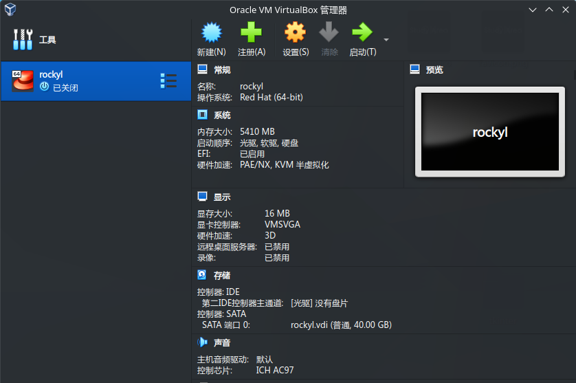
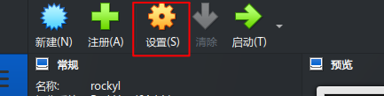
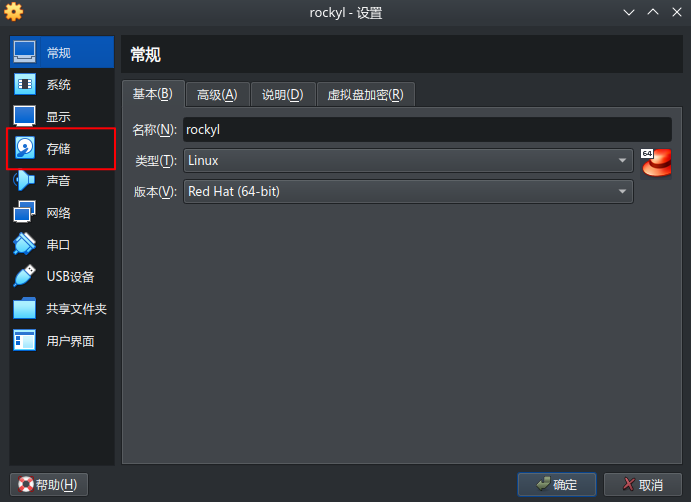
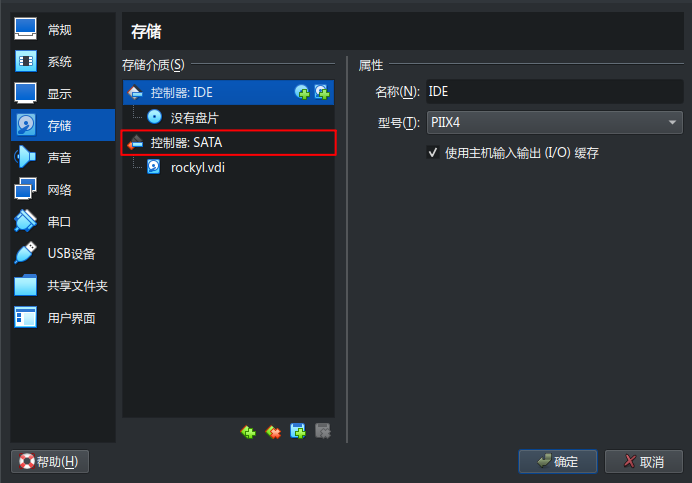
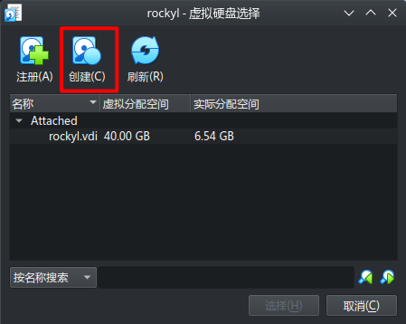
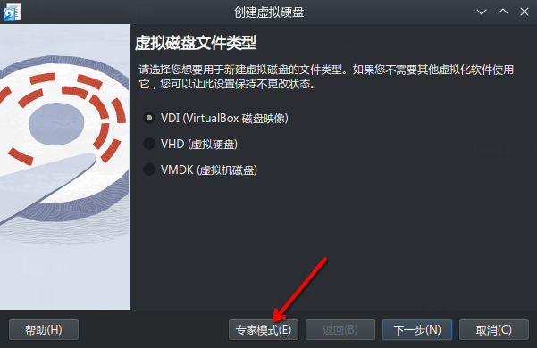
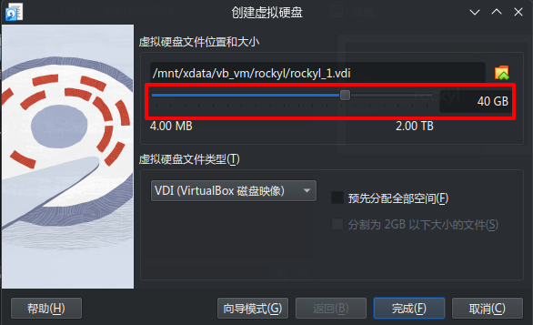
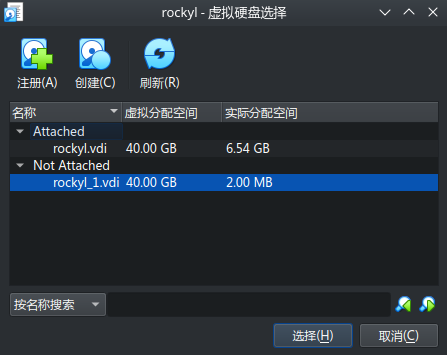

# 在 VirtualBox 上创建虚拟磁盘

> 上级目录：[磁盘分区以及文件系统](../diskpart_and_filesystem.md)

按照上篇文件，我们接下来需要创建一个虚拟磁盘。

## 打开虚拟机

首先，打开你的 VirtualBox 并选择你的虚拟机。

## 配置磁盘

我们打开设置

在左边找到 `存储`

选择 `控制器: SATA`，如果你这里看不见这个选项，那么就选择 `xxx.vdi` 那一项所在的那一栏。

然后我们点击右面添加磁盘的图标

选择创建

## 创建磁盘

我们就来到了创建磁盘的界面。

我们点击最下面的 `专家模式`

然后我们设置磁盘大小，为了后面的学习，我们需要设置磁盘的大小 >= 原来的系统磁盘的大小。

## 完成创建

我们点击 `完成`，然后会来到下面的界面。我们点击 `选择`，再点击一下 `确定`

恭喜你，磁盘创建完成！

---

请继续学习接下来的内容：[磁盘分区以及文件系统](../diskpart_and_filesystem.md)

---

> study-area-cn
