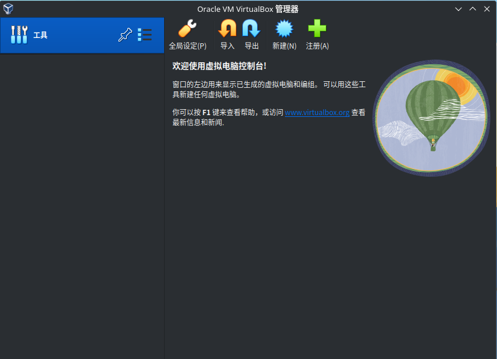
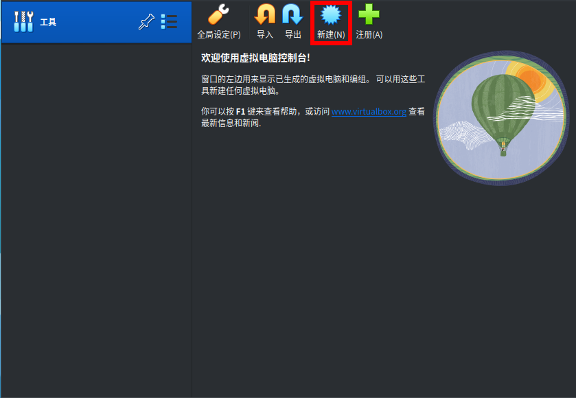
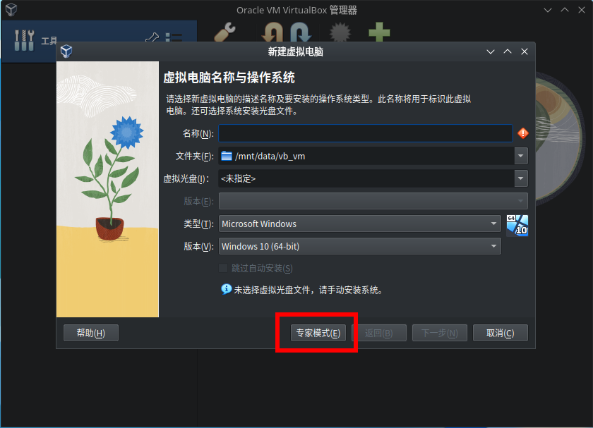
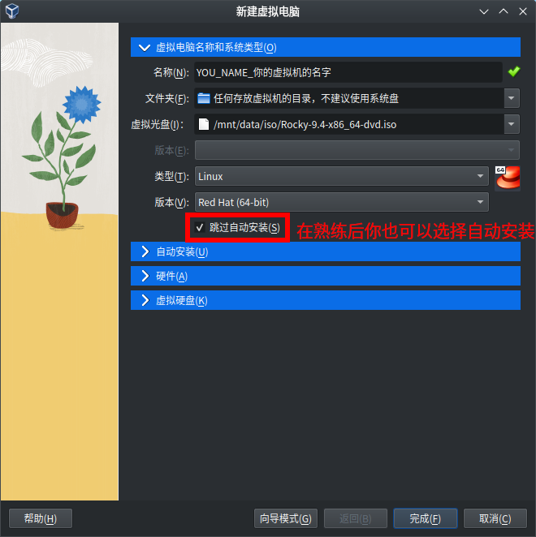
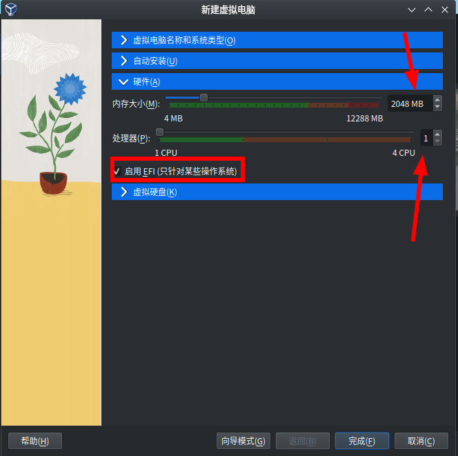
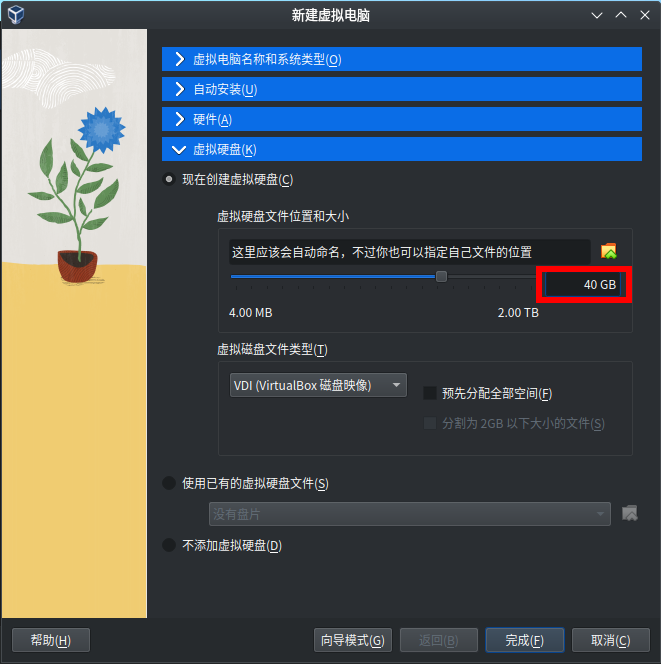
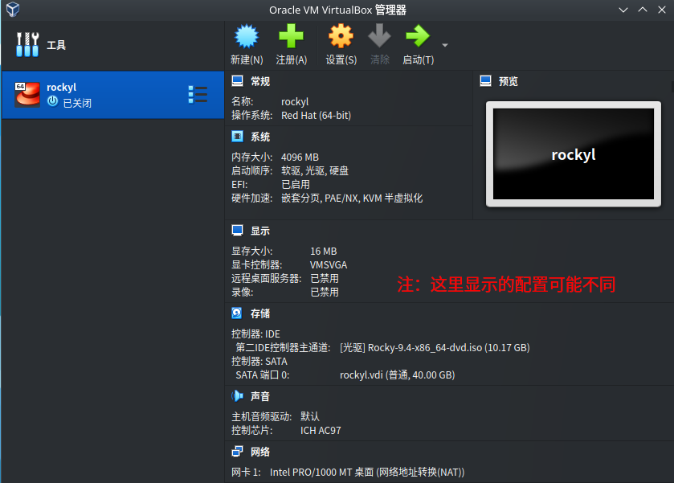
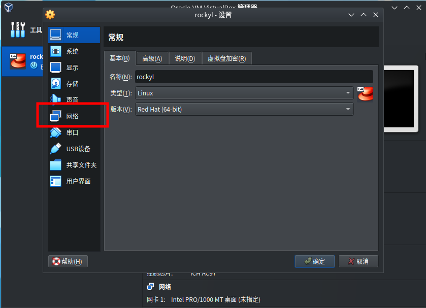
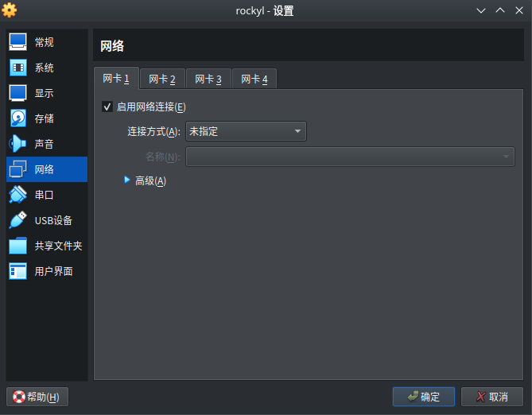

# 在 VirtualBox 上安装 Rocky Linux

> 上级目录：[Rocky Linux初见](../install_rocky_linux.md)

在进行安装前我们需要去下载一份 Rocky Linux 的镜像，在[Rocky Linux初见](../install_rocky_linux.md)中有说明，此处不再赘述。

## 0x00 下载并安装 VirtualBox

我们要在虚拟机上安装Linux，首先我们得要有个虚拟机软件。本篇文章选择了一个免费并且十分好用的虚拟机——VirtualBox。

如果你已经安装过了，那么这一段可以直接跳过。

这里不过多介绍VirtualBox，只简单介绍一下 VirtualBox(下文可能会简称vbox) 的安装和使用。

首先，我们需要使用你的浏览器去[VirtualBox官网](https://www.virtualbox.org/)(`www.virtualbox.org`)下载一份安装包。

你应该会看见一个全是英文的页面，不过不要害怕，即使你的英文不好，你只要跟着下面的操作来就可以了。

看到下面巨大的蓝色的 `Download` 按钮了吗？点一下，你会被带到下载页面，然后我们可以看见 `VirtualBox 7.x.xx(这里是最新的版本号) platform packages` 字样，下面就是安装链接。

> 注：截至本篇文章编写时版本号是 `7.0.18`

在下面有包括 `​Windows hosts` 和 `​macOS / Intel hosts` 等字样。你只需要点击你的操作系统对应的链接，就可以把安装包下载下来了。

> 如果你是一个小白，不知道你用的是什么操作系统，那么你就选第一个

然后我们运行安装程序（应该会在下面或者右面的下载列表，点一下就可以），又会弹出一个界面。我们此时只需要忽略所有警告无脑 `下一步`(Next) 即可。

> 注：如果你已经在使用任何的Linux系统，请尽可能切换到 x11 桌面环境（小白可以不用管这一条）。

然后我们启动 vbox，进行下一步安装。

## 0x01 新建并虚拟机

软件我们有了，接下来我们要给虚拟机注入灵魂——操作系统了

不过在安装操作系统之前，我们要新建一个虚拟机。

启动软件后，我们会看到如下界面：


> 注：本界面为linux下截图，可能会因操作系统和软件版本而有略微不同

然后我们选择 `新建` 一个虚拟机


我们会看到如下的界面：


我们点击下方标红按钮开启`专业模式`。不过虽然叫做`专业模式`，但是只要按着教程走，就没有什么难度。

开启专业模式后，界面发生了变化。不过万变不离其宗，我们还是要进行一些配置的。

首先，我们填写好虚拟机的名字（随便起，但最好不要有中文）。


然后点击从上往下数第三项`虚拟光盘`右面的向下箭头，会弹出一个菜单。我们选择最后一项`其它...`，然后找到我们之前下载的 ISO 格式的镜像并点击确定。


然后勾选`跳过自动安装`(自动安装并不利于学习，不过当你熟练操作后也可以自动安装。你就需要在`自动安装`选项卡中配置用户名和密码等)

然后我们选择第三个小蓝条`硬件`。

我们可以根据需要填写`内存大小`和`处理器`(处理器核心数)。如果你还不知道这两个是什么意思，请回看上一大章节。

以下是我推荐的计算方法：

```text
如果你的电脑内存 <= 2GB：
    很抱歉你的电脑不满足最低的硬件要求，不过你仍旧可以尝试在实体机上安装。
    (不过我相信你也搞不到这么老的电脑了吧)
如果你的电脑内存是 4GB：
    那么你应该填写 `2048MB`(2GB) 为系统留出足够空间
如果你的电脑内存是 8GB
    这时你填写 `6144MB`(6GB) 即可。如果你希望同时在主机干点别的的话，填`4096MB`(4GB) 即可
如果你的电脑内存 > 8GB
    这时你填多少都可以，只不过最好各留出最少 4G(4096MB) 的内存
    例如笔者的电脑是 12GB(49152MB)，那么就可以填写 `8192MB`(8GB)

CPU数通常只需要填你的CPU核心数的一半就可以了。现在的电脑至少2核起步。
如果你在使用13代或以上的Intel酷睿，那么你填写你的大核心(P核)的数量就行。
(截至本篇编写时Intel最新的酷睿还是13代，2024.6)
```

然后勾选上`启用 EFI` (在vbox6可能会存在bug，使用vbox6的建议升级一下)



接下来是创建虚拟机的最后一步——设置虚拟磁盘。选择最后一个小蓝条`虚拟硬盘`。


我们只需要关心画红框的磁盘大小。

如果你的磁盘空间足够，那么你开多少都行，一般开40GB就够了。

不过即使你的硬盘空间再紧张，这个数也不能低于10GB。~~(不过ISO镜像都超过10GB了)~~

接下来点击`完成`就大功告成啦！


## 0x02 启动虚拟机

> 注意：接下来的操作请您看完[Rocky Linux初见](../install_rocky_linux.md)的剩余内容后再操作。

然后我们点击绿色的`启动`按钮


稍等片刻，会弹出一个新的窗口，你会看到一片黑，上面还有着文字，那就是GRUB了。


---

接下来请继续阅读[安装 Rocky Linux](./install_rocky_linux.md)进行安装。

## 0x03 安装增强功能

> 注：请安装完系统再进行本段内容

//TODO:待补充...
