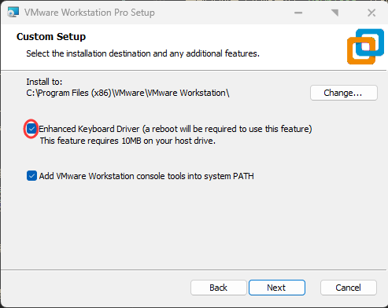
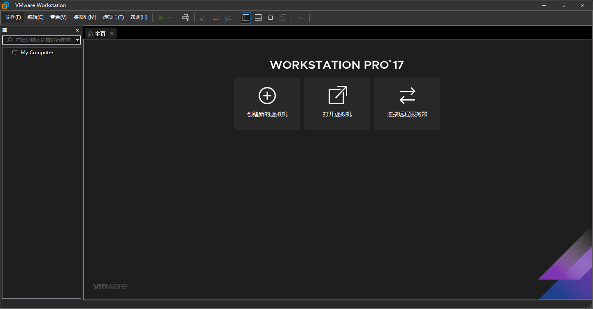
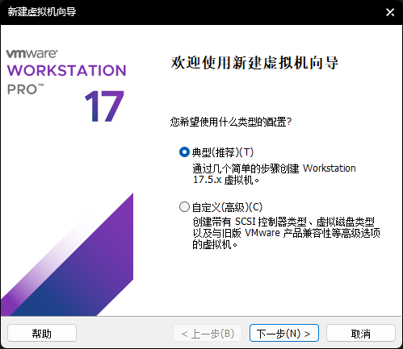
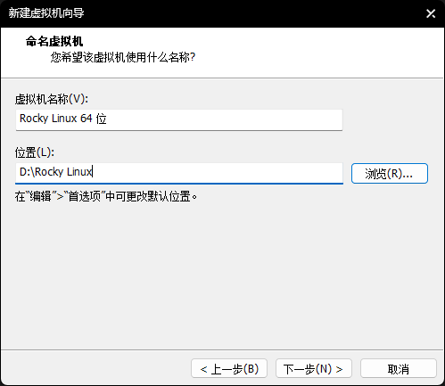
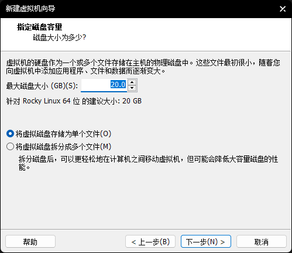
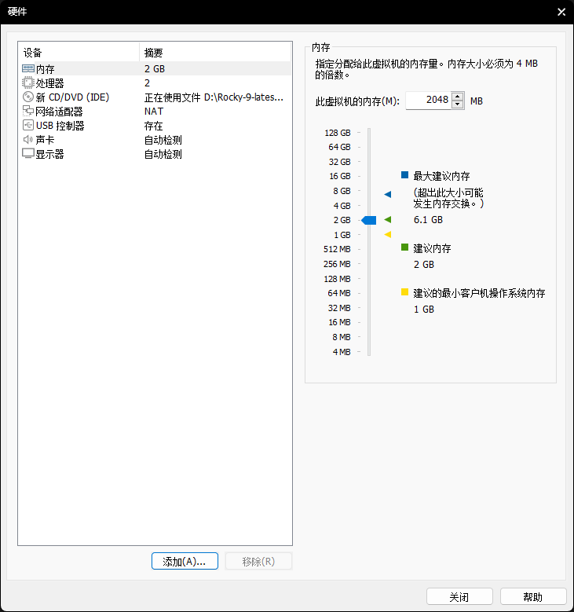
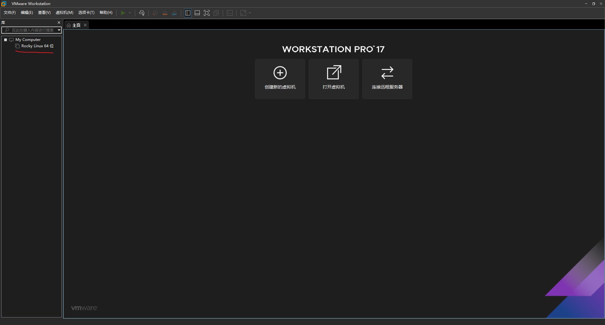
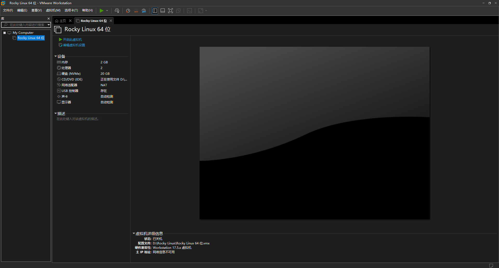
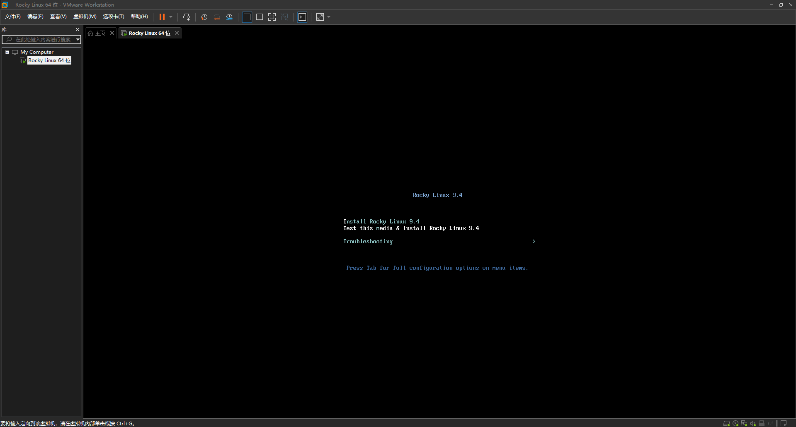

# 在 VMWare Workstation 上安装

> 上级目录：[Rocky Linux初见](../rocky_first_met.md)

在进行安装前我们需要去下载一份 Rocky Linux 的镜像，在[Rocky Linux初见](../rocky_first_met.md)中有说明，此处不再赘述。

## 0x00 下载并安装 VMWare Workstation Pro

假设说你要安装Linux的话,你需要一个虚拟机软件,本部分将使用VMWare Workstation Pro,一款十分好的多平台虚拟机软件.

> 当然,[VirtualBox](install_in_vbox.md)也一样

假如说你已经安装过了,你完全可以跳过这一段.

这里可能有朋友问,VMWare Workstation Pro(下文简称VMWW)不是付费的吗?你这样难道想让我们去用盗版?

这点不用担心,因为在VMware被博通Broadcom收购了之后,博通就宣布VMWW的17.5.2版本对个人用户免费&ensp;~~(什么资本家大发慈悲)~~,所以盗版的事情各位大可不必担心.

原本来说,你应该去注册一个博通的账号并且去到Broadcom Support Portal搞一大堆麻烦事情,但是我相信各位的精力是有限的,所以说这里直接贴出提取到的下载链接`https://softwareupdate.vmware.com/cds/vmw-desktop/ws/17.5.2/23775571/windows/core/VMware-workstation-17.5.2-23775571.exe.tar`

在您下载下来之后是一个tar文件,如果说您的电脑没有可以解压这种格式的软件,那请您去下载一个名为7-Zip的软件`https://7-zip.org/a/7z2407.exe`然后安装,记得关联格式.

在解压出来之后,我们就可以运行安装程序,先Next,同意完协议并Next后记得勾选一下`安装键盘驱动`(如下图)



然后就可以一路Next下去了,安装完成后会有一次重启,在重启完毕后,我们该启动VMWW,进行下一步安装了.

>假如说这里有朋友发现VMWW的页面是英文的,打开VMWW的`快捷方式`,在目标后面添加一个" --locale zh_CN"之后重启VMWW就好了.

## 0x01 新建虚拟机

很好,现在您已经拥有了一个趁手的工具,那就该干点什么,也就是注入灵魂——操作系统了

不过在开始安装系统前,我们需要新建一个`虚拟机`.

启动软件后,我们会看到像这样的页面:



然后点击 `创建新的虚拟机`  ,您会看到这样的界面:



保持典型不变,点击下一步,点击`安装程序光盘映像文件(iso)(M)`,然后点击游览,找到你镜像下载到的位置,选中镜像,然后打开:


接着点击下一步,填写`虚拟机的名字`还有`虚拟机的安装位置`(这一步记得选一个剩余空间比较大的分区)



现在开始设置`虚拟磁盘`,这相当于您电脑的储存空间,这里直接引用隔壁VBox安装的话:

如果你的磁盘空间足够，那么你开多少都行，一般开40GB就够了。

不过即使你的硬盘空间再紧张，这个数也不能低于10GB。~~(不过ISO镜像都超过10GB了)~~



然后我们就来到了配置设置页面,现在点击`自定义硬件`,还是引用Vbox安装的话:

我们可以根据需要填写`内存大小`和`处理器`(处理器核心数)。如果你还不知道这两个是什么意思，请回看上一大章节。

以下是我推荐的计算方法：

```text
如果你的电脑内存 <= 2GB：
    很抱歉你的电脑不满足最低的硬件要求，不过你仍旧可以尝试在实体机上安装。
    (不过我相信你也搞不到这么老的电脑了吧)
如果你的电脑内存是 4GB：
    那么你应该填写 `2048MB`(2GB) 为系统留出足够空间
如果你的电脑内存是 8GB
    这时你填写 `6144MB`(6GB) 即可。如果你希望同时在主机干点别的的话，填`4096MB`(4GB) 即可
如果你的电脑内存 > 8GB
    这时你填多少都可以，只不过最好各留出最少 4G(4096MB) 的内存
    例如笔者的电脑是 12GB(49152MB)，那么就可以填写 `8192MB`(8GB)

CPU数通常只需要填你的CPU核心数的一半就可以了。现在的电脑至少2核起步。
如果你在使用13代或以上的Intel酷睿，那么你填写你的大核心(P核)的数量就行。
(截至本篇编写时Intel最新的酷睿还是13代，2024.6)
```

对于写者来说,设置完之后的页面如下:



最后关闭设置页面,点击`完成`,虚拟机就大功告成了!(如果你勾选了`创建后启动此虚拟机`那么则会自动启动)

## 0x03 启动虚拟机

假如说您在上一部勾选了`创建后启动此虚拟机`的话,您的虚拟机应该现在已经启动了,但是以防万一,这里还是讲解一下如何在VMWW里启动虚拟机:

第一步,选中`虚拟机`:



第二步,点击`开启此虚拟机`:



等一会后,会出现一个类似这样的页面,这里直接选中第一项然后回车就可以了:



---

接下来请继续阅读[安装 Rocky Linux](./install_rocky_linux.md)进行安装.


---
> study-area-cn