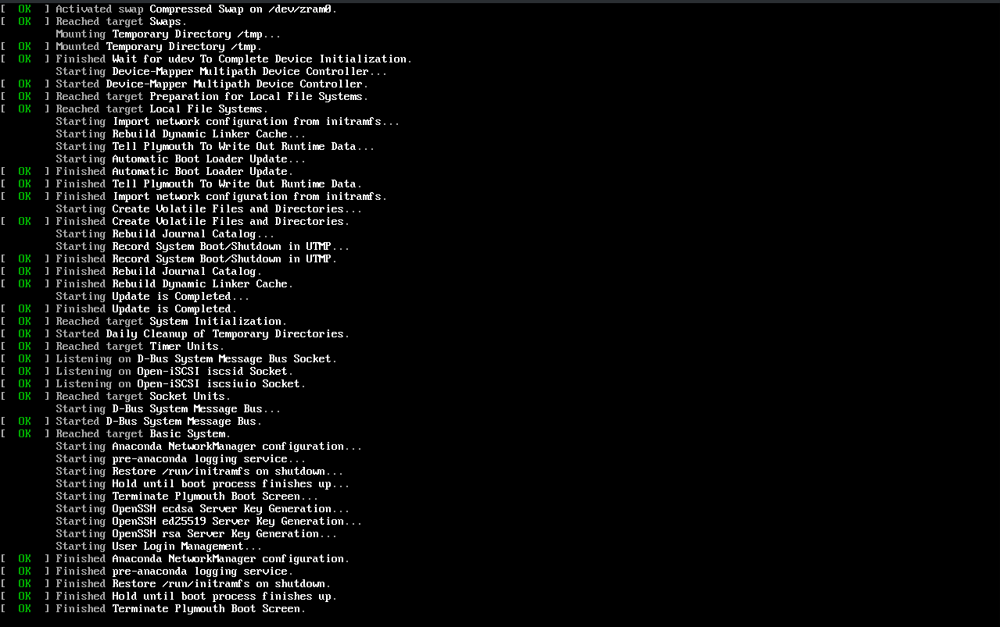

# 安装 Rocky Linux

按照上面的步骤，我相信你应该已经配置完了你的虚拟机/实体机，进入了GRUB界面。

## 0x00 引导并进入安装页面

接下来，我们需要使用键盘的上下方向键选中GRUB菜单的第一项，才能进入安装。

记住选择完了不要在那里干等着，GRUB还没有那么智能，你得按一下 回车`[Enter]` 让GRUB明白你选择的是哪一项。

之后是一段启动过程了，启动过程不会等很长时间，2-3分钟就能完成。

然后是选择语言。如果你是在虚拟机安装的，语言一般都会自动选择。直接按右下角蓝色按钮继续即可。

如果默认语言是英文怎么办？你可以在左侧列下方输入`Chinese`，点击第一个蓝色项目，在右边也点击第一个（简体中文，在中国香港和中国台湾的小伙伴分别点第3个和第2个），此时你的语言应该就变成了中文。

接下来我们就来到了安装界面。

我们在接下来的步骤需要填写以下项目：

* 软件选择
* 安装目标位置
* root密码
* 创建用户

## 0x01 软件选择

软件选择部分相对较简单。

如果你是虚拟机或者准备拿来当作主力电脑，那么就选`工作站`，如果你是用于搭建网页，就选`带 GUI 的服务器`(不推荐，GUI增加工作负荷)或`服务器`(命令操作，上手难度较大，不过可以配合web面板，并且要有两台电脑)

如果你选择了`工作站`，那么推荐把右面的`GNOME 应用程序`勾上，包含了文本编辑器等一大堆功能（非必选）。

选择完成后点击`完成`即可返回到上一页面

## 0x02 安装目标位置

这应该是本次安装中最难的一节了。

### 虚拟机/单系统

> 在安装前请确保格式化并删除了你硬盘的所有分区！(虚拟机不用管)

如果你不需要安装Windows，或者你在虚拟机里安装，请参考下面的方案。

我们只需要在`本地标准磁盘`点击勾选我们的磁盘（已经钩了就不用再点），然后点`完成`即可。

### 多硬盘多系统

多硬盘多系统也比较简单，和单系统差不多，但是在选择硬盘时请

**一定要核对硬盘大小！** 
**一定要核对硬盘大小！** 
**一定要核对硬盘大小！**

> PS:笔者因为选错盘丢过数据！

### 单硬盘多系统

> 新手请勿尝试！系统容易无法引导！请至少准备一个急救盘(WinPE，推荐WePE，确保即使引导配置错误也能够修复)！

这是三种里面最难的情况了。

//TODO: 待补充...

## 0x03 设置root密码/新建帐号

接下来我们设置用户名和密码。

首先设置Root密码。这个用户具有系统的最高权利，可以管理系统的一切事物，哪怕删除系统运行`rm -rf /*`（开个玩笑，请勿执行）都可以。

我们输入两次密码即可。如果你在你的服务器上使用，最好取消勾选`锁定Root账户`，然后点击确定返回。如果你发现确定点一次没有用，那么是你的密码过于简单，请再点一次确认或更改您的密码。

然后我们可以使用同样的方法设置用户账户。

账户名不能有中文或者部分特殊符号。记得**一定一点**勾选`将此用户设为管理员`。

## 0x04 开始安装

> 请一定在安装前核对配置选项！数据可能存在风险！作者概不负责！

我们再看一下配置完毕的页面：

点击`开始安装`，开始你的Linux学习之路！

接下来，你可以去泡杯茶或去干点别的事情。安装过程会耗费大约30分钟到1小时。请耐心等待……

---
...... 一小时以后 ......

---

安装完成！

安装完成后，请在虚拟机的配置中卸载你的ISO文件，实体机请拔出你的U盘，然后点击重启。

## 0x05 首次登录

经过折腾，我们终于看到登录界面了！我们只需要点击你的用户头像，再输一遍密码，就能进入桌面了。

然后我们可以关掉桌面上“欢迎使用”的弹窗（看了，没有什么有用的内容）

## 0x06 如何关机

环顾桌面，我们并没有看到“开始菜单”，那么如何关机呢？

其实左上角的`活动`就相当于“开始菜单”，但是关机也不在这里。

我们点击右上角的电源按钮（其实是一整排一个按钮），依次选择`关机/注销--关机`，然后在弹出的窗口确认，稍等就可以关机了。

## 0x07 换源

//TODO:待补充...
