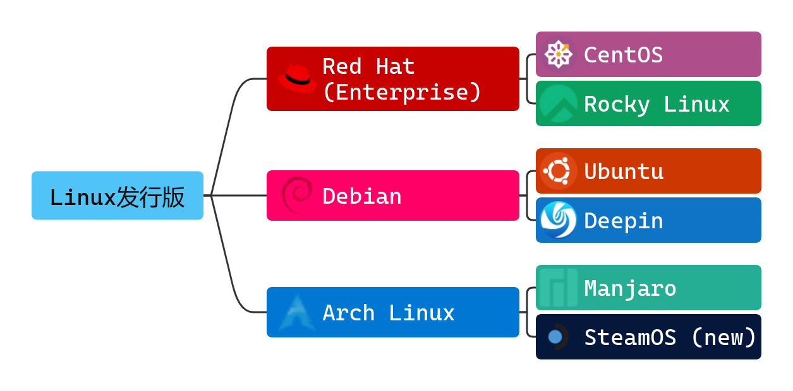

# Linux 发行版(distribution, distro)

## 什么是 Linux 发行版

> Linux 发行版是一个由 Linux 内核、GNU 工具、附加软件和软件包管理器组成的操作系统，它也可能包括显示服务器和桌面环境，以用作常规的桌面操作系统。［1］

如果你不是理解以上的内容，那么请跟随我往下看：

我们前文提到了`Linux Kernel`。Linux Kernel只是一个操作系统的核心，甚至连一个能够操作的界面都没有。而我们常常提到的`Linux`通常指Linux发行版，而发行版就相当于在Linux Kernel外面添加了诸多软件，可以让Linux“开箱即用”(我们有时说的`OOBE`就是“开箱即用体验”的意思)。

这些发行版附带了很多来自 GNU 的开源软件，所以这类发行版也被称为`GNU/Linux 发行版`。

Linux基本命令中的极大部分都来自 GNU(coreutils)，如 `cat`、`grep`、`awk`、`bash`，甚至最简单的`ls`、`cp`，都来自于 GNU。

> 当然 GNU 工具并不是唯一的选择，常见的还有嵌入式的`busybox`等。

如果没有这些工具，你甚至连一个只能敲命令的黑框框(tty)都见不到。

> 目前唯一常用的的非 GNU/Linux 发行版是 Android AOSP，就是我们平常用的安卓手机(准确来说AOSP只是个基础)。
>
> AOSP使用了非常复杂的方法把内核独立出来，包括 glibc 等东西都重写了一遍，从而无需遵守内核和 GNU 各个组件的 GPL 开源协议。(不过这事一直都有争议)

用我们前面的比喻：内核就是一辆汽车的引擎，而软件就是汽车的其它部分，这两者缺一不可。而发行版就是直接给你了一辆完整的汽车，你可以直接开走。

甚至绝大多数的发行版的内核都是可以手动更换的，并且也不会太麻烦。

## 有哪些 Linux 发行版

说到Linux发行版，那可真的是成千上万了。有一个项目 [Linux Distribution Time Line](https://github.com/FabioLolix/LinuxTimeline) 展示了大多数Linux发行版之间的关系。不过这里面的绝大多数我们听都没听说过。

完整的图片在[文章结尾](#linuxdistributiontimeline)

笔者在下面总结了一些常见发行版：

* `RedHat` 使用 rpm/yum 管理软件包的一款发行版，有良好的企业级支持，但是 Enterprise 需要付费（衍生无需）。
  * `CentOS` 之前服务器最常用的 Linux 发行版(CentOS 7&8)，不过现在已部分停止开发，使用人数较少
  * `RockyLinux` 新兴的 RedHat 系发行版，可以作为CentOS的继任者在服务器端使用，也可用于桌面系统
* `Debian` 使用 dpkg/apt 管理软件包，操作简单，功能易学丰富，也适合作为服务器系统
  * `Ubuntu` 最受欢迎的桌面Linux发行版，笔者初入Linux选择的就是本系统。Ubuntu还有Server服务器版本，不过不是很好用
  * `Deepin` 国产的一款Linux系统，使用独有的DDE桌面，开箱即用界面美观，但是bug较多，且性能要求较高
* `ArchLinux` 使用独有的 pacman 管理软件包，有庞大的AUR支持。新手上手难度极高，默认只有命令行界面，但定制性也极高，但是系统为滚动更新，较不稳定，容易“滚挂”（指更新软件包导致系统无法启动等问题），被网友戏称为“邪教”
  * `Manjaro` 一款基于 ArchLinux 的带有图形界面的发行版，新手较为友好
  * `SteamOS` 一款默认被用在 SteamDeck 上的专为游戏设计的操作系统，对游戏的兼容性较好

还有一些比较小众的发行版，如`NixOS`、`Alpine Linux`，这里不一一说明了。

## 如何选择适合的发行版

选择发行版没有一个完美的答案，真正还要根据你自身来选择。不同发行版有不同优势。

搭建网页可以选 RockyLinux 或是 Debian，安全稳定文档多。
如果你在为一家企业搭建服务并有充足预算，可以使用 RedHatEnterprise。

长期使用可以优先选 Ubuntu，小白可以尝试 Deepin，软件包格式方便好找，自带应用商店。

如果你有足够的基础和一定英文能力(其实大学四六级应该就够了)，喜欢折腾，那么ArchLinux是你的不二之选，占用小，可定制性极强。无论如何，Archlinux不应被安装在追求稳定的服务器上。

如果你不打算安装在实体机上，那么还是推荐 `RockyLinux`。

> 记住：发行版上的软件一般仅提供了源码级的兼容性，如果你使用的发行版的软件源没有该软件，最好自已编译一下。二进制文件在不同的发行版上，行为有可能不同

## 注释

［1］摘自linux.cn

## 附录

### LinuxDistributionTimeLine

> (2024.6.6构建)

---
> study-area-cn
