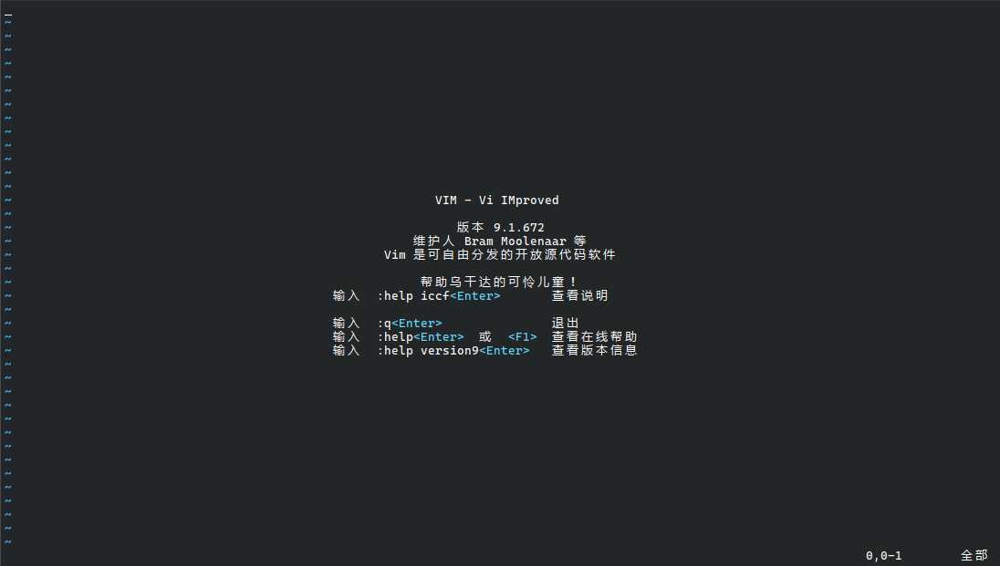
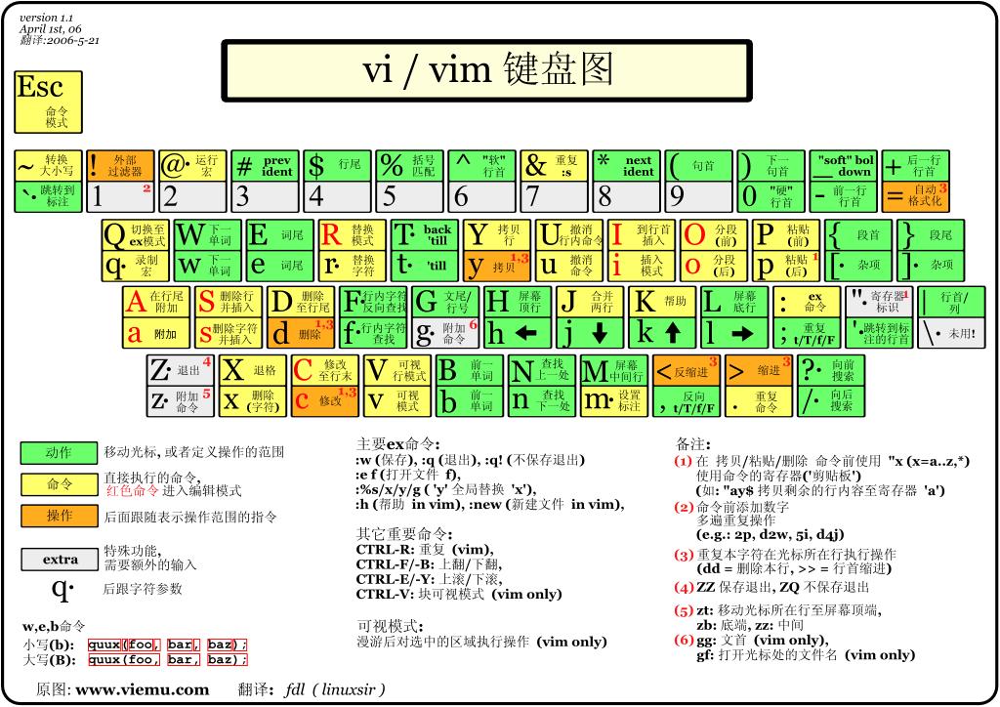

# Vim 编辑器

> 在 Vim 中所有的键位注意区分大小写，所有大写的命令都需要按下 `Shift` 键，例如 `V` 表示为 `S-v`

不知道你有没有听说过 Bram 发明的 Vim 编辑器，有这么一个梗，就是：

> 如何产生一串随机字符串？答：让新手退出 Vim。

你应该能看出 Vim 的操作是多么“反人类”了吧。事实上，在 Vim 发明的时候，电脑上还没有鼠标，所有的操作只能靠命令完成的（可以想一想 tty）。所以，Vim 的设计理念就是让用户通过键盘完成所有的操作。

但是，我们如果要通过终端远程管理一台 Linux 服务器，那么必须使用像 Vim 这样的终端编辑器。Vim 的功能比前文的 Nano 强大许多，如果你熟悉了 Vim，那么你的速度可能远远超过那些使用其它编辑器的人。

> Vim 的前身是 Vi，本文的绝大部分命令同样适用于 Vi。几乎所有的 Linux 发行版都自带 Vi 或是 Vim 其中之一，不用担心是否安装了 Vim。其实 Windows 上也可以安装 Vim。
>
> 如果你在 Vim 中困住了，只需要按下 `<Esc>:q!<Enter>` 就可以退出 Vim 了

## 启动 Vim

Vim 的启动十分简单，只需要在终端输入 `vim` 即可。

```bash
vim [文件名]
```

文件名是可选的。如果文件存在，Vim 就会打开这个文件；如果文件不存在，Vim 就会创建这个文件。

然后你会看到如下界面：



## Vim 的使用

首先，我们进入 Vim，会发现我们并不能像 Nano 一样直接打字。这是因为 Vim 默认处于“命令模式”，我们需要按下对应的按键可以进入到不同的模式。记住：无论在任何时候，按下 `Esc` 键都可以回到命令模式。

下面是一张 Vim 的键位图：



如果看不懂也没关系，下面我们会讲解其中常用的一些功能。

### Vim 的“模式”

Vim 有一个最基本的东西“模式”，在不同模式下，快捷键的功能会有所不同。Vim 会在左下角提示你所在的模式。

以下是常见的模式：

- `命令模式` 这个是 Vim 启动所在的模式，以下的所有内容均在这个模式内进行。其它模式均可以使用 `Esc` 退出到命令模式。
- `编辑模式` 使用 `i` 进入，底部会提示 `-- INSERT --`(`-- 插入 --`)，在这个模式下，你可以正常编辑文档，和一般的文本编辑器无异。
  - `替换模式` 底部会提示 `-- REPLACE --`(`-- 替换 --`)，使用 `R` 进入，这个模式与编辑模式差别不大，但是你输入的所有内容都会替换光标后的内容。
- `选择模式` 原名是“可视模式”，使用 `v` 进入，底部会提示 `-- VISUAL --`(`-- 可视 --`)，你可以选择一段文本进行操作。
  - `选择行模式` 使用 `V` 进入，底部会提示 `-- VISUAL LINE --`(`-- 可视 行 --`)，此时所有的选择都变成了整行选择。操作没有任何区别。
- `底部命令行模式` 使用 `:`、`/`、`?` 进入（功能不同），此时整个底部都会变成命令行，以 `:` 与 `/` 等字符开头，此时可以输入命令，按下 `Enter` 就可以执行并退出。

### 移动光标

在命令模式下，我们可以使用键盘上的方向键来移动光标。但是，我们也可以使用 Vim 提供的命令来移动光标：

```text
     ^
     k
< h     l >
     j
     v
```

> 当你熟悉了 `hjkl` 的使用后，你会发现使用这几个命令比使用方向键快多了

### 命令行

我们输入 `:` 就可以进入命令行（和上面的底部命令行模式有点区别）了。在 Vim 中，命令行负责了许多复杂的工作。

下面是最常见的命令组合：

- `:w` 保存文件
- `:wq` 保存并退出 Vim
- `:q!` 强制退出 Vim（文件未保存的情况下）

> `!` 接在命令后表示强制执行一个命令
>
> 另外，在 `w` 命令后面可以接上文件保存的路径，实现另存为的功能，例如 `:w 1.txt`

其中命令行模式的其它功能我们在下面还会讲到。

### 删除与剪切

假如有一大段文字，在 Vim 中又不能像图形化一样鼠标一拖一删，那么如何快速删除呢？

在 Vim 中，我们可以单独使用 `x` 和 `d` 命令，也可以在“可视模式”（待会会讲到）下编辑。

`x` 命令可以删除光标所指的当前字符，而 `d` 命令的功能就比较复杂了。`d` 命令是一个“多字符命令”，需要在 `d` 后面输入其它的东西搭配使用。

> `d` 命令实际上是剪切，后面会说如何粘贴

下面是一些例子（均包括开头的 `d`）：

- `dd` 删除整行
- `dw` 删除当前单词（以空格分割）
- `d0` 删除这行从光标的位置到最前
- `d$` 删除这行从光标的位置到最后

> 在 Vim 中，很多命令例如 `x`、`d` 和后文的 `y`、`G`、`gg` 等前面都可以加一个数字，表示重复这个命令多少次，例如 `5dd` 就是删除5行，包括 `hjkl` 也可以。

### 复制

前面我们说到了 `d` 的本质是剪切，那么我们如何复制呢？`y` 命令便可以复制。

> 注意：Vim 的剪贴板是独立的，和系统使用的不同

`y` 命令和 `d` 命令的用法如出一辙，例如 `yy` 就是复制整行，`yw` 就是复制单词。

### 粘贴

`p` 命令代表 `parse`，就是粘贴。可以粘贴使用 `y` 复制或者 `d` 剪切的内容。

### 跳转

如果我们想要快速在文件中跳转，那么`gg` 命令和 `G` 命令是不可或缺的。

`gg` 命令可以让你快速来到文件的开头，而 `G` 命令单独使用可以来到文件尾部，

这个两个命令前面加上数字，就可以快速跳转到指定的行（`G` 命令也是从头开始数的）。

使用也非常简单，按一下就可以，前面也可以加数字。

另外，可以使用 `0` 跳转到行首和 `$` 跳转到行尾。

`d` 和 `y` 命令后面也可以接 `gg`、`G`、`0`、`$` 命令，效果就是从指定的位置选择到当前光标所在处。

### 重复上一个命令

这个命令是 `.`，没错，就是点。可以重复你的上一个命令。

### 选择模式（可视模式）

可视模式，这个名字其实有点误导人。事实上，这个模式就是选择一段文字。（事实上你如果在终端中直接使用鼠标进入的就是这个模式）

下面是在可视模式中的操作：

- 使用 `hjkl` 移动（当然方向键也可以）
- `y` 复制
- `d` 剪切
- `x` 删除
- `p` 覆盖粘贴
- `gg`、`G`、`0`、`$` 移动光标

### 查找内容

在 Vim 中，我们可以使用 `/` 进行查找，输入 `/` 然后再输入关键词。

在查找过程中，我们可以使用 `n` 查找下一个，`N` 查找上一个。

### 小技巧：使用 `:!` 快速调试 Shell 脚本

在使用 Vim 的过程中，假如我们需要调试一个 Shell，那么我们就需要退出 Vim，启动脚本，再打开 Vim，十分的麻烦。不过 Vim 提供了一个命令 `:!` 来让我们快速运行一行命令。

```text
:! [要执行的命令]
```

然后我们会跳出 Vim，并看到这个命令的执行结果。如果想要回到 Vim，只需要在程序结束后敲一下 `<Enter>` 便可以回到 Vim 了。

另外，我们可以单独使用 `:!` 查看执行的历史记录。

## Vim 的配置

在 Vim 中，我们可以使用 `:set (no)[配置名]` 去开关某些配置。

对于有参数的配置，可以使用 `:set [配置名]=[值]`

下面是一些常用配置：

```text
:set number              "启用行号
:set autoindent          "自动缩进
:set autoread            "如果文件有更改自动更新文件
:set wrap                "自动折行
:set encoding=utf-8      "设置显示格式，文件显示乱码可尝试调整
:set fileencoding=utf-8  "设置写入格式
:set hlsearch            "高亮搜索结果
```

这些配置都是临时启用，如果每次启动时都要手动配置，属实有点麻烦。那么该怎么办呢？我们可以将配置文件写入 `~/.vimrc` 文件实现永久配置。（注意所有配置不要带冒号）

> 其实 Vim 的功能远不止如此，感兴趣的可自行了解 VimScript 相关内容。

## 课后作业

Vim 的功能十分强大，并且在维护时十分常用。下面的练习可以帮你更好掌握 Vim：

> 试试看在下面的过程中，全程不使用方向键吧！

1. 使用 `touch` 新建一份 `.sh` 文件，文件名随意
2. 使用 Vim 编辑这个文件，使用 `echo` 输出一个 `helloworld`
3. 保存这个文件
4. 使用 `:!` 运行这个文件
5. 退出 Vim
6. 使用 Vim 定制你的 `~/.vimrc` 配置文件
7. 你也可以将这个配置文件发到论坛上与小伙伴交流
