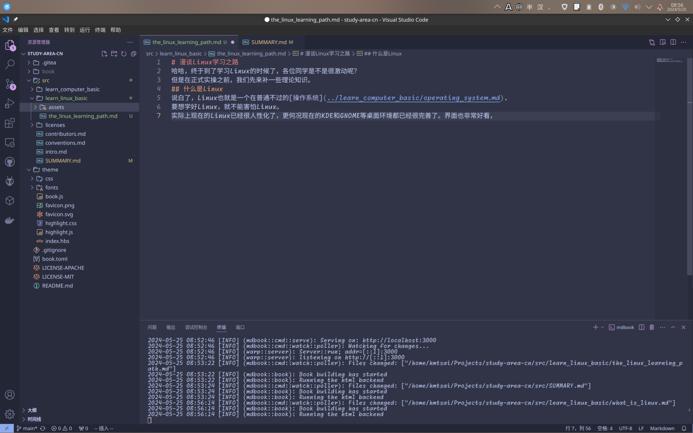

# 漫谈Linux学习之路

哈哈，终于到了学习Linux的时候了，各位同学是不是很激动呢？
但是在正式实操之前，我们先来补一些理论知识，也给大家鼓鼓劲。

## 怎么学Linux？
说白了，Linux也就是一个在普通不过的[操作系统](../learn_computer_basic/operating_system.md).
要想学好Linux，就不能害怕Linux。
实际上现在的Linux已经很人性化了，更何况现在的KDE和GNOME等桌面环境都已经很完善了。界面也非常好看。比如这张图片就是笔者在撰写这篇文章时的截图。

是不是也很漂亮？没错，现在Linux已经很漂亮，日常使用一点问题都没有。您要做的，只是打消自己的疑虑，好好的迎接Linux，让它融入你的生活。

## 命令太多我记不住，怎么办？
实际上我们没有人会特意记命令。有个人开玩笑就说
> 直接用Linux就好了啊没有人用Windows是先看"Windows 使用理论与实践"的。

虽然这只是一句玩笑，但是也挺有道理的。
每天用Linux,所以总结成一句话就是：多看，多练。

## Windows这么好用，为什么要Linux？

四点：稳定性，可修改性，完全控制性和系统占用

### 1.稳定性
如果你试着把Windows连续开着几天做高强度的运算任务不关机的话，你很有可能会发现系统出了很多奇奇怪怪的问题：比如开始菜单无法正常加载啊，窗口移动时会撕裂啊。
而Linux就没有这些问题，无论多长时间都几乎不用关机维护。长时间的运算任务也不会影响到系统的使用。

### 2.可修改性
Linux内核本身，和在Linux上使用的大部分软件都是开源软件。开源的好处就是源代码开放，你可以自由修改。比如自己适配一个新硬件啊，修改系统的调度策略啊，精简一下内核啊。这些在Windows这种闭源操作系统上都是做不到的。

### 3.完全控制性
在Linux里，root是完全自由的，是可以控制整个系统的，它是系统里面的最高权限。
不像Windows，Windows即便你是admin，系统也会控制你的行为，比如删除系统文件这种操作就是完全做不到的。
有的同学可能会问：那不是代表Linux不安全吗？
其实这个看法也对，也不对：因为把系统完整的权限交给用户，确实可能会造成一些不安全的行为。但是Windows是把系统的完全控制权交给微软，你不知道这个系统里面有没有什么后门。所以相比把权限交给其他人，还是把权限牢牢的攥在自己手里更安心。
而且由于SELinux和用户组这些东西，Linux一般用户的权限都是受到限制的，正常使用没有什么不安全的问题。
> SELinux这东西极大的提高了Linux的安全，我们后文也会讲到。

### 4.系统占用
系统占用这个没什么好解释的，给你几个数据你就明白了：

这是我的电脑在两个系统下的占用（刚刚开机，Windows自带GUI，Linux：KDE）

|系统|CPU|内存|
|-----|-----|-----|
|Linux|0.8%|2G/16G|
|Windows|12.1%|6G/16G|

看出来了吧，Linux对于系统占用是很小的。同样的钱购买硬件，Linux可以让更多的性能分配给你的应用。

这些东西，应该也解释清楚你的问题了吧？
那么接下来我们就开始正式的学习吧！

---
> 编写: Hmtsai 
> study-area-cn
